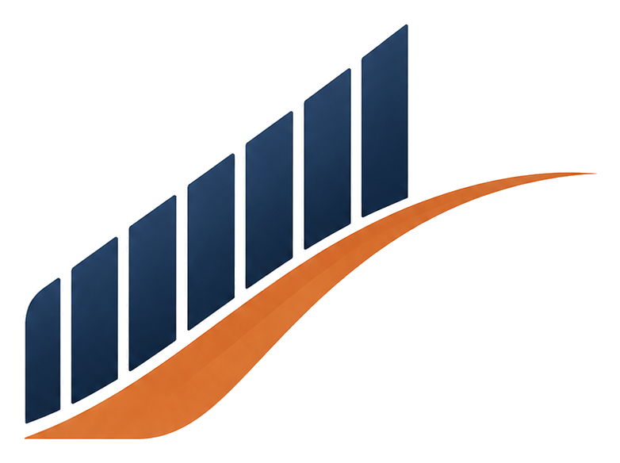

<div align="center">



# مبادرة تعلَّم الذكاء الاصطناعي

**منهجٌ ذاتيٌّ مبسّطٌ لتعلّم الذكاء الاصطناعي في سبعة أيّام — نصف ساعةٍ في اليوم، للمبتدئين تمامًا.**

[](https://taalmai.com)
&nbsp;
[](LICENSE)
&nbsp;
[](CONTRIBUTING.md)

[**زيارة الموقع المباشر ←**](https://taalmai.com)

</div>

---

<div dir="rtl">

## عن المبادرة

مبادرةٌ **مجّانيّةٌ ومفتوحة المصدر** تأخذ المبتدئ من نقطة الصفر إلى أوّل تجربةٍ حقيقيّةٍ مع الذكاء الاصطناعي خلال أسبوعٍ واحد، بإيقاعٍ مريح: نصف ساعةٍ في اليوم.

الفكرة المركزيّة: **الذكاء الاصطناعي أداةٌ، لا غاية.** لا نسعى إلى صناعة خبراء في أسبوع، بل إلى نقلك من خانة "المتفرّج" إلى خانة "المُستخدِم الواثق" الذي يُدخل هذه الأدوات في عمله ودراسته وقراراته اليوميّة.

كلّ يومٍ يحتوي: **فكرةً مركزيّة + فيديو مختارًا + شرحًا مبسّطًا + مهمّةً عمليّة + سؤال تأمّل.**

## ما بداخل المستودع (Repo)

```
.
├── README.md           هذا الملف
├── LICENSE             رخصة MIT
├── CONTRIBUTING.md     دليل المساهمة
├── CODE_OF_CONDUCT.md  ميثاق سلوك المجتمع
├── .github/            قوالب Issues و Pull Requests
└── src/                الموقع
    ├── index.html      الكتيّب — سبعة أيّام
    ├── roadmap.html    خارطة الطريق — مصادر رسميّة
    └── assets/
        ├── icons/      الشعار · favicon · apple-touch
        └── social/     صور المشاركة الاجتماعيّة (og)
```

الموقع **ثابتٌ بالكامل** (HTML/CSS/JS فقط) — لمعاينته افتح `src/index.html` في أيّ متصفّح مباشرةً. لا خادم، ولا خطوة بناء.

## الفلسفة التي بُني عليها المحتوى

- **لغةٌ عربيّةٌ فصحى سهلة** — موجّهةٌ لغير التقنيّين، بلا مصطلحاتٍ مُعجِزة.
- **مصادر رسميّةٌ فقط** — من الشركات الصانعة للنماذج مباشرةً (Anthropic، OpenAI، Google، IBM، Microsoft)، لا وسطاء.
- **تطبيقٌ كلّ يوم** — مهمّةٌ عمليّةٌ تُنتج أثرًا ملموسًا، لا قراءةً سلبيّة.
- **مهاراتٌ لا معلومات** — الهدف أن تستطيع فعل شيءٍ جديدٍ بنهاية الأسبوع.
- **وقتٌ واقعيّ** — لا دوراتٌ بعشر ساعاتٍ في اليوم؛ نصف ساعةٍ تكفي.

## المساهمة

هذا المشروع للمجتمع، ونرحّب بمساهمتك بصدق. أمثلةٌ على ما يفيد:

- تصحيح خطأ لغويّ أو معلوماتيّ
- تحسين الشرح ليصبح أوضح لغير التقنيّ
- إضافة مصدر رسميّ حديث من جهة معتمدة
- تحسينات الوصوليّة (accessibility) والأداء
- ترجمة المحتوى إلى لغات أخرى

اقرأ [**دليل المساهمة (CONTRIBUTING.md)**](CONTRIBUTING.md) قبل أن تبدأ — فيه قواعد الأسلوب والخطوات.

## خارطة التطوير

- [ ] تحسينٌ مستمرٌّ للمحتوى بناءً على ملاحظات القرّاء
- [ ] إضافة نسخةٍ صوتيّةٍ مختصرةٍ لكلّ يوم
- [ ] دعمٌ أفضل للوصوليّة وقارئات الشاشة
- [ ] ترجماتٌ مجتمعيّة

## الترخيص

هذا المشروع مرخّصٌ تحت [رخصة MIT](LICENSE) — حرٌّ للاستخدام والتعديل وإعادة النشر مع حفظ الإسناد.

## التواصل

المهندس علي المطرفي
eng.motrafi@gmail.com

</div>

<div align="center">

صُنع بشغفٍ لمجتمعٍ عربيٍّ يتعلّم.

</div>
